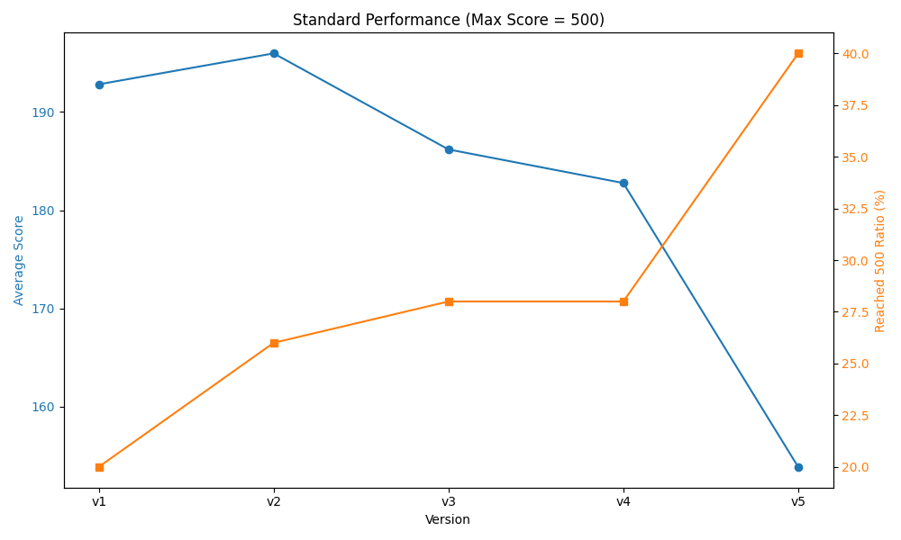
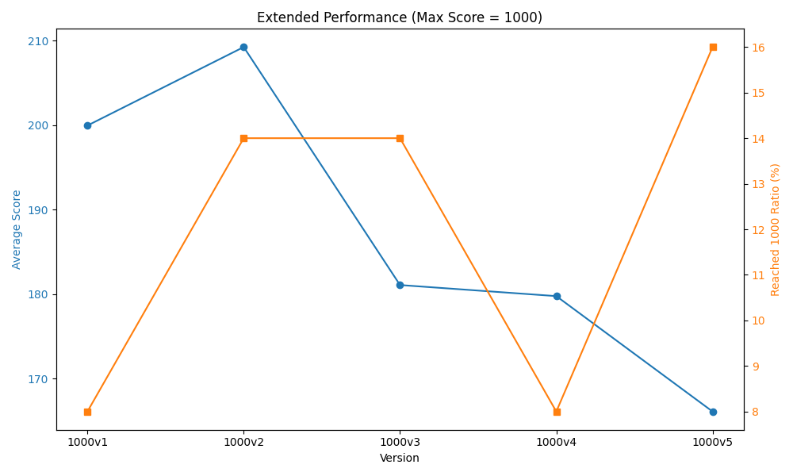

# 🧠 DQN CartPole Experiments

This repository contains Deep Q-Network (DQN) experiments on the CartPole-v1 environment using PyTorch.  
It is structured to support multiple experimental versions, with organized results and summaries across two tracks: **standard** and **extended**.

---

## 🧪 Motivation for Extended Experiments

In the standard CartPole-v1 environment, the maximum score is capped at 500.  
As our models improved, this ceiling masked real differences.
So, we ran extended experiments with a 1000-step limit to better capture long-term performance.

(See “Key Findings” below for detailed insights.)

---

## 📁 Project Structure
```
dqn_cartpole/
├── standard/                    ← CartPole-v1 default (max score = 500)
│   ├── v1_basic_dqn/
│   ├── v2_double_dqn/
│   ├── v3_dueling_dqn/
│   ├── v4_double_dueling_dqn/
│   ├── v5_double_dueling_per_dqn/
│   └── results/                ← Contains v1/ to v5/ result CSVs and README
│       ├── v1/
│       ├── v2/
│       ├── v3/
│       ├── v4/
│       └── v5/

├── extended/                   ← Custom CartPole (max score = 1000)
│   ├── 1000v1_basic_dqn/
│   ├── 1000v2_double_dqn/
│   ├── 1000v3_dueling_dqn/
│   ├── 1000v4_double_dueling_dqn/
│   ├── 1000v5_double_dueling_per_dqn/
│   └── results/               ← Contains 1000v1/ to 1000v5/ result CSVs and README
│       ├── 1000v1/
│       ├── 1000v2/
│       ├── 1000v3/
│       ├── 1000v4/
│       └── 1000v5/

```

- Each version folder contains both training and test code.
- The results/ subdirectory in each track summarizes 50-trial performance metrics for every version.

---

## 🔧 Requirements

- Python 3.10+
- `torch`
- `gymnasium`
- `numpy`
- `pandas`

Install all with:

```bash
pip install torch gymnasium numpy pandas
```
---

## 📊 Summary of Results

We conducted two sets of experiments:

- `standard/`: max episode = 500  
- `extended/`: max episode = 1000

Each contains 5 DQN variants (v1 ~ v5).  
Both sets implement the same algorithms, allowing for direct comparison under different scoring constraints.  
This structure highlights how performance trends change as the environment ceiling shifts.

→ For detailed metrics and analysis, see:  
- [standard/README.md](./standard/README.md)  
- [extended/README.md](./extended/README.md)

---

## 🧪 Experiment Overview

This project evaluates how various improvements to the Deep Q-Network algorithm affect learning performance on CartPole-v1.


We applied the following settings to all experiments:

```python
gamma = 0.99                # Discount factor  
epsilon = 1.0               # Initial exploration rate  
epsilon_min = 0.01          # Minimum exploration rate  
epsilon_decay = 0.995       # Exploration decay rate  
learning_rate = 0.001       # Adam optimizer learning rate  
batch_size = 32             # Batch size for training  
memory_size = 5000          # Size of experience replay buffer  
train_start = 1000          # Minimum experiences before training starts  
N = 5                       # Target network update interval (every N episodes)  
```

---

Variants Implemented:

| Version | Algorithm                                |
|---------|-------------------------------------------|
| v1      | Basic DQN                                 |
| v2      | Double DQN                                |
| v3      | Dueling DQN                               |
| v4      | Double + Dueling DQN                      |
| v5      | Double + Dueling + Prioritized Replay (PER) |

All five variants were tested in two settings:

- **Standard** : default CartPole (max score = 500)
- **Extended** : custom CartPole (max score = 1000)

This structure enabled clearer comparisons when models frequently reached the max score.

---

## 📊 Key Findings

We conducted 10 experiments in total:
- 5 standard versions (max score = 500)
- 5 extended versions (max score = 1000)

All experiments used the same training setup and hyperparameters, allowing us to isolate the impact of algorithmic changes.

Here are our main findings:

- **Basic DQN (v1)**: Quickly reaches moderate performance but struggles with stability and rarely hits perfect scores.
- **Double DQN (v2)**: Effectively reduces overestimation, resulting in improved average performance and score consistency.
- **Dueling DQN (v3)**: Offers better state value estimation but is sensitive to noise, leading to high variance.
- **Double + Dueling DQN (v4)**: Combines strengths of v2 and v3; balances learning efficiency and score potential.
- **+ Prioritized Replay (v5)**: Unlocks the highest max scores (especially in extended), but also introduces severe volatility.

### 🧠 Why Extended?

In the standard setting, agents in v3~v5 often reached the 500-point cap.  
This made it hard to measure improvements — hitting 500 doesn’t tell us *how much better* one model is from another.

We extended the environment (max score = 1000) to fix this.  
As a result, performance trends became clearer:  
- **v5 consistently reached over 500**, but also showed **greater instability**
- **v2 and v4 had strong average scores**, showing stable learning
- **v3 lagged behind in the extended setting**, suggesting its weakness in long-term planning

---

📝 Summary:
- Algorithmic upgrades improve score ceilings but often reduce stability
- The 1000-score setup better exposes the *shape* and *reliability* of each learning curve
- Every improvement has trade-offs — and this setup makes those trade-offs visible


---

### 📈 Visual Summary

Below are line plots comparing average scores and optimal score ratios (500 or 1000) across all 5 versions:

- **Standard Setting (max = 500):**  
  Average score and Reached 500 Ratio (%)



- **Extended Setting (max = 1000):**  
  Average score and Reached 1000 Ratio (%)



> Detailed results and interpretation are provided in each version folder and summarized in `standard/README.md` and `extended/README.md`.


---

## 📌 Conclusion

This project demonstrates how architectural improvements to DQN affect learning performance under different evaluation ceilings.

We found that:
- Basic DQN is fast but inconsistent.
- Upgrades like Double and Dueling help, but not always in expected ways.
- Prioritized Replay (PER) unlocks high scores, but makes performance less reliable.

To better understand these trade-offs, we extended the episode cap to 1000.  
This allowed us to observe longer-term learning trends and better distinguish performance between versions.

🔍 For more detailed discussion, please refer to the README files inside the `standard/` and `extended/` folders.

---

### 🧠 Final Reflections

Because CartPole-v1 is a relatively simple environment, it was not always easy to see clear differences between algorithms like Basic, Double, Dueling, or PER.  
However, as the models grew more sophisticated, we observed an increase in the number of episodes that reached the maximum score — whether it was 500 or 1000. This suggests that architectural upgrades do help agents discover optimal behaviors more frequently.

One hypothesis that emerged during the analysis is the role of the epsilon-greedy strategy.  
In this project, we used `epsilon_decay = 0.995` with only 300 episodes. This led to exploration being maintained for a longer portion of training, which may have prevented the agent from fully converging to a stable policy during evaluation.  
Because of that, some trials using advanced structures (like Dueling or PER) may have resulted in lower scores, despite having strong potential.

If similar experiments are conducted in the future, it may be worth revisiting the epsilon settings or increasing the number of episodes per trial to allow the policy more time to stabilize.

---

## 📌 Blog Version  
This project is also available on my blog:  
🔗 [https://0xgumi.netlify.app/projects/dqn-cartpole](https://0xgumi.netlify.app/projects/dqn-cartpole)
